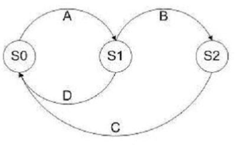
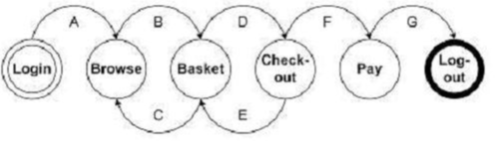
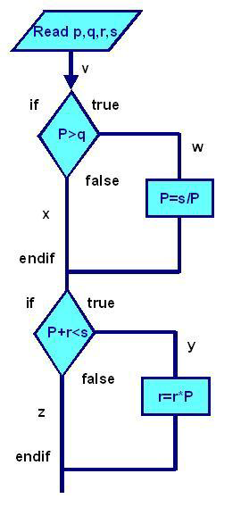
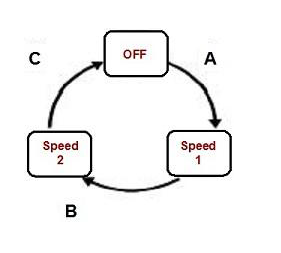
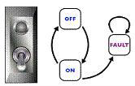

# Exam Questions : Chapter 04 - Part 1

1. Given the following state transition table Which of the test cases below will cover the following series of state transitions? S1 SO S1 S2 SO Exhibit: 

    

    1. D, A, B, C. 
    2. A, B, C, D. 
    3. D, A, B. 
    4. A, B, C. 

2. Given the following state transition diagram Which of the following series of state transitions contains an INVALID transition which may indicate a fault in the system design? Exhibit: 

    

    1. Login Browse Basket Checkout Basket Checkout Pay Logout. 
    2. Login Browse Basket Checkout Pay Logout. 
    3. Login Browse Basket Checkout Basket Logout. 
    4. Login Browse Basket Browse Basket Checkout Pay Logout. 

3. Given the following fragment of code, how many tests are required for 100% decision coverage? 

    ```
    1. if width > length 
    2. then 
    3. biggest_dimension = width 
    4. if height > width 
    5. then 
    6. biggest_dimension = height 
    7. end_if 
    8. else 
    9. biggest_dimension = length 
    10. if height > length 
    11. then 
    12. biggest_dimension = height 
    13. end_if 
    14. end_if 
    ```

    1. 3 
    2. 4 
    3. 2 
    4. 1 

> Each IF condition needs a test, so 4 tests are needed. Two input combinations can cover 100%, `h > w > l` and `w > h > l`


4. You have designed test cases to provide 100% statement and 100% decision coverage for the following fragment of code. 

    ```
    1. if width > length 
    2. then 
    3. biggest_dimension = width 
    4. else 
    5. biggest_dimension = length 
    6. end_if 
    ```

    The following has been added to the bottom of the code fragment above. 

    ```
    print "Biggest dimension is " & biggest_dimension 
    print "Width: " & width 
    print "Length: " & length 
    ```

    How many more test cases are required? 

    1. One more test case will be required for 100 % decision coverage. 
    2. Two more test cases will be required for 100 % statement coverage, one of which will be used to provide 100% decision coverage. 
    3. None, existing test cases can be used. 
    4. One more test case will be required for 100" statement coverage. 

5. A thermometer measures temperature in whole degrees only. If the temperature falls below 18 degrees, the heating is switched off. It is switched on again when the temperature reaches 21 degrees. What are the best values in degrees to cover all equivalence partitions? 

    1. 15,19 and 25. 
    2. 17,18 and 19. 
    3. 18, 20 and 22. 
    4. 16, 26 and 32. 

> The BVA will be `... 17 | 18 19 20 | 20 ...`

6. Given the following decision table: Which of the following test cases and expected results is VALID?

    | Conditions | Rule 1 | Rule 2 | Rule 3 | Rule 4 |
    | -- | -- | -- | -- | -- |
    | Age | <21 yrs | 21-29 yrs | 30-50yrs | > 50yrs |
    | Insurance Class | A | A or B | B or C or D | C or D |
    | **Actions** | | | | |
    | Premium | £100 | £90 | £70 | £70 |
    | Excess | £2,500 | £2,500 | £500 | £1000 |

    1. 23 year old in insurance class A Premium is 90 and excess is 2500. 
    2. 51 year old in insurance class C Premium is 70 and excess is 500. 
    3. 31 year old in insurance class B Premium is 70 and excess is 2500. 
    4. 43 year old in insurance class C Premium is 70 and excess is 1000.

7. A wholesaler sells printer cartridges. The minimum order quantity is 5. There is a 20% discount for orders of 100 or more printer cartridges. You have been asked to prepare test cases using various values for the number of printer cartridges ordered. Which of the following groups contain three test inputs that would be generated using Boundary Value Analysis? 

    1. 5, 6, 20 
    2. 4, 5, 80 
    3. 4, 5, 99 
    4. 1, 20, 100

> 4 [invalid ] | 5 ... [valid] ... 99 | 100 [valid+20%] ...

8. Match the following terms and statements. 

| | |
| -- | -- |
| 1. Decision Table Testing  | W. Testing carried out w boxes to achieve specific test objectives, possibly to complement structured testing. |
| 2. Decision Testing  | X. A test technique used which may be used to verify different system re depending on current conditions or previous history. |
| 3. State Transition Testing | Y. A test technique which combines combinations of inputs that might not otherwise have been exercised during testing. |
| 4. Exploratory Testing | Z. A form of control flow testing based on decision outcomes. |

    1. 1Y, 2Z, 3X, 4W. 
    2. 1X ,2W, 3Z, 4Y. 
    3. 1Z, 2X, 3W, 4Y. 
    4. 1Z, 2Y, 3X, 4W.

9. Which type of test design techniques does the following statement best describe: “a procedure to derive test cases based on the specification of a component”? 
    1. Black Box Techniques. 
    2. White Box Techniques. 
    3. Glass Box Techniques. 
    4. Experience Based Techniques.

10. Which of the following types of defects is use case testing MOST LIKELY to uncover? 
    - i) Defects in the process flows during real-world use of the system. 
    - ii) Defects in the interface parameters in integration testing. 
    - iii) Integration defects caused by the interaction and interference of different components. 
    - iv) Defects in the system as it transitions between one state and another.

    1. ii, iii. 
    2. i, iii. 
    3. iii, iv. 
    4. i, ii

11. The diagram represents the following paths through the code. 

    

    - A. vwy 
    - B. vwz 
    - C. vxy 
    - D. vxz 

    What is the MINIMUM combination of paths required to provide full statement coverage?

    1. A 
    2. ABD 
    3. ABCD 
    4. ACD

> Note that is asks for `Statement coverage`. Paths `x` and `z` dont have any statement, so `A` is enough

12. Which of the following is MOST characteristic of specification based (black-box) techniques?
    1. Test cases can be easily automated. 
    2. Test cases are independent of each other. 
    3. Test cases are derived systematically from models of the system  
    4. Test cases are derived systematically from the delivered code.

> ?

13. Complete statement and branch coverage means:
    1. That you have tested every statement in the program. 
    2. That you have tested every statement and every branch in the program.
    3. That you have tested every IF statement in the program.
    4. That you have tested every combination of values of IF statements in the program

14. We can achieve complete statement coverage but still miss bugs because:
    1. The failure occurs only if you reach a statement taking the TRUE branch of an IF statement, and you got to the statement with a test that passed through the FALSE branch.
    2. The failure depends on the program's inability to handle specific data values, rather than on the program's flow of control.
    3. We are not required to test code that customers are unlikely to execute.
    4. All of the above

15. ‘X’ has given a data on a person age, which should be between 1 to 99. Using BVA which is the appropriate one
    1. 0, 1, 2, 99 
    2. 1, 99, 100, 98 
    3. 0, 1, 99, 100 
    4. –1, 0, 1, 99

16. Which is not a black box testing technique
    1. Equivalence partition 
    2. Decision tables 
    3. Transaction diagrams 
    4. Decision testing

17. Purpose of test design technique is
    1. Identifying test conditions only, not Identifying test cases
    2. Not Identifying test conditions, Identifying test cases only 
    3. Identifying test conditions and Identifying test cases
    4. Identifying test conditions or identifying test cases

18. Arc testing is known as 
    1. Branch testing 
    2. Agile testing
    3. Beta testing 
    4. Ad-hoc testing

19. The ___________ technique can be used to achieve input and output coverage
    1. Boundary value analysis 
    2. Equivalence partitioning 
    3. Decision table testing 
    4. State transition testing

20. The principle of Cyclomatic complexity, considering L as edges or links, N as nodes, P as independent paths 
    1. L-N +2P 
    2. N-L +2P 
    3. N-L +P 
    4. N-L +P

21. White Box Techniques are also called as: 
    1. Structural Testing 
    2. Design Based Testin 
    3. Error Guessing Technique 
    4. Experience Based Technique

22. The Switch is switched off once the temperature falls below 18 and then it is turned on when the temperature is more than 21. When the temperature is more than 21. Identify the Equivalance values which belong to the same class.
    1. 12, 16, 22 
    2. 24, 27, 17 
    3. 22, 23, 24 
    4. 14, 15, 19 

23. What is an equivalence partition (also known as an equivalence class)?
    1. A set of test cases for testing classes of objects 
    2. An input or output range of values such that only one value in the range becomes a test case
    3. An input or output range of values such that each value in the range becomes a test case
    4. An input or output range of values such that every tenth value in the range becomes a test case.

24. The Test Cases derived from use cases 
    1. Are most useful in uncovering defects in the process flows during real world use of the system
    2. Are most useful in uncovering defects in the process flows during the testing use of the system
    3. Are most useful in covering the defects in the process flows during real world use of the system
    4. Are most useful in covering the defects at the Integration Level

25. One of the fields on a form contains a text box which accepts alpha numeric values. Identify the Valid Equivalence class
    1. BOOK 
    2. Book 
    3. Boo01k 
    4. book

26. In an Examination a candidate has to score minimum of 24 marks inorder to clear the exam. The maximum that he can score is 40 marks. Identify the Valid Equivalance values if the student clears the exam.
    1. 22, 23, 26 
    2. 21, 39, 40 
    3. 29, 30, 31 
    4. 0, 15, 22

27. Which of the following techniques is NOT a White box technique?
    1. Statement Testing and coverage 
    2. Decision Testing and coverage 
    3. Condition Coverage 
    4. Boundary value analysis

28. One of the fields on a form contains a text box which accepts numeric values in the range of 18 to 25. Identify the invalid Equivalance class 
    1. 17 
    2. 19 
    3. 24 
    4. 21

29. What's the disadvantage of Black Box Testing?
    1. Chances of having repetition of tests that are already done by programmer. 
    2. The test inputs needs to be from large sample space. 
    3. It is difficult to identify all possible inputs in limited testing time. So writing test cases is slow and difficult 
    4. All above

30. Performs sufficient testing to evaluate every possible path and condition in the application system. The only test method that guarantees the proper functioning of the application system is called as _______.
    1. Regression Testing 
    2. Exhaustive Testing 
    3. Basic Path Testing
    4. Branch Testing

31. During testing, a defect was found in which the system crashed when the network got disconnected while receiving data from the server. The defect was fixed by correcting functionality which checks the network availability during data transfer. Existing test cases did cover 100% of the module statements. To verify the fix and ensure more extensive coverage, some tests were designed and added to the test suite. What types of testing are mentioned above?
    - I. Functional testing
    - II. Structural testing
    - III. Confirmation testing
    - IV. Performance testing

    1. I, III and IV
    2. I and III
    3. II and IV 
    4. I, II and III

32. The testing technique that requires devising test cases to demonstrate that each program function is operational is called
    1. Black-box testing 
    2. Glass-box testing 
    3. Grey-box testing 
    4. White-box testing

33. A white box testing technique that measures the number of or percentage of decision directions executed by the test case designed is called
    1. Condition coverage 
    2. Decision/Condition coverage 
    3. Decision Coverage 
    4. Branch coverage

34. _______ includes both Black box and White Box Testing features 
    1. Gray Box Testing 
    2. Hybrid Testing 
    3. A. & B. 
    4. None

35. Incorrect form of Logic coverage is:
    1. Statement Coverage 
    2. Pole Coverage 
    3. Condition Coverage 
    4. Path Coverage

36. Code Coverage is used as a measure of what?
    1. Defects 
    2. Trends analysis 
    3. Test Effectiveness 
    4. Time Spent Testing

37. Statement Coverage will not check for the following. 
    1. Missing Statements 
    2. Unused Branches 
    3. Dead Code 
    4. Unused Statement

38. Given the Following program
    ```
    IF X <>= Z 
    THEN Statement 2; 
    END 
    ```

    McCabe’s Cyclomatic Complexity is: 
    1. 2 
    2. 3 
    3. 4 
    4. 5

39. Boundary value testing
    1. Is the same as equivalence partitioning tests
    2. Test boundary conditions on, below and above the edges of input and output equivalence classes 
    3. Tests combinations of input circumstances 
    4. Is used in white box testing strategy

40. An input field takes the year of birth between 1900 and 2004. The boundary values for testing this field are:
    1. 0, 1900, 2004, 2005 
    2. 1900, 2004
    3. 1899, 1900, 2004, 2005 
    4. 1899, 1900, 1901, 2003, 2004, 2005

41. How many test cases are necessary to cover all the possible sequences of statements (paths) for the following program fragment? Assume that the two conditions are independent of each other:
    ```
    1. if (Condition 1) 
    2. then statement 1 
    3. else statement 2
    4. fi 
    5. if (Condition 2) 
    6. then statement 3
    7. fi 
    ```

    1. 2 Test Cases 
    2. 3 Test Cases 
    3. 4 Test Cases 
    4. Not achievable

42. A common test technique during component test is 
    1. Statement and branch testing 
    2. Usability testing 
    3. Security testing 
    4. Performance testing

43. Equivalence partitioning is:
    1. A black box testing technique used only by developers 
    2. A black box testing technique than can only be used during system testing 
    3. A black box testing technique appropriate to all levels of testing 
    4. A white box testing technique appropriate for component testing

44. Which of these can be successfully tested using Loop Testing methodology?
    1. Simple Loops 
    2. Nested Loops 
    3. Concatenated Loops 
    4. All of the above

45. Cyclomatic Complexity method comes under which testing method. 
    1. White box 
    2. Black box 
    3. Green box 
    4. Yellow box

46. Order numbers on a stock control system can range between 10000 and 99999 inclusive. Which of the following inputs might be a result of designing tests for only valid equivalence classes and valid boundaries:
    1. 1000, 5000, 99999 
    2. 9999, 50000, 100000 
    3. 10000, 50000, 99999 
    4. 10000, 99999 
    5. 9999, 10000, 50000, 99999, 10000

47. Given the following: 
    ```
    1. Switch PC on 
    2. Start "outlook" 
    3. IF outlook appears THEN 
    4. Send an email 
    5. Close outlook
    ```
    1. 1 test for statement coverage, 1 for branch coverage 
    2. 1 test for statement coverage, 2 for branch coverage 
    3. 1 test for statement coverage. 3 for branch coverage 
    4. 2 tests for statement coverage, 2 for branch coverage 
    5. 2 tests for statement coverage, 3 for branch coverage

48. Given the following code, which is true: 
    ```
    1. IF A > B THEN 
    2. C = A – B 
    3. ELSE 
    4. C = A + B 
    5. ENDIF 
    6. Read D
    7. IF C = D THEN
    8. Print "Error" 
    9. ENDIF
    ```

    1. 1 test for statement coverage, 3 for branch coverage 
    2. 2 tests for statement coverage, 2 for branch coverage 
    3. 2 tests for statement coverage. 3 for branch coverage 
    4. 3 tests for statement coverage, 3 for branch coverage 
    5. 3 tests for statement coverage, 2 for branch coverage

49. Consider the following state transition diagram of a two-speed hair dryer, which is operated by pressing its one button. The first press of the button turns it on to Speed 1, second press to Speed 2 and the third press turns it off.

    

    Which of the following series of state transitions below will provide 0-switch coverage? 

    1. A,C,B 
    2. B,C,A 
    3. A,B,C 
    4. C,B,A

50. Which of the following is NOT a black box technique:
    1. Equivalence partitioning 
    2. State transition testing 
    3. LCSAJ 
    4. Syntax testing 
    5. Boundary value analysis

> `Linear code sequence and jump`, in the broad sense, is a software analysis method used to identify structural units in code under test. Its primary use is with dynamic software analysis to help answer the question "How much testing is enough?"

51. Consider the following:

    ```
    1. Pick up and read the newspaper 
    2. Look at what is on television 
    3. If there is a program that you are interested in watching then switch the the television on and watch the program 
    4. Otherwise 
    5. Continue reading the newspaper 
    6. If there is a crossword in the newspaper then try and complete the crossword
    ```

    1. SC = 1 and DC = 1 
    2. SC = 1 and DC = 2 
    3. SC = 1 and DC = 3 
    4. SC = 2 and DC = 2 
    5. SC = 2 and DC = 3

52. Consider the following statements about early test design:
    - i. Early test design can prevent fault multiplication 
    - ii. Faults found during early test design are more expensive to fix 
    - iii. Early test design can find faults 
    - iv. Early test design can cause changes to the requirements 
    - v. Early test design takes more effort 

    1. i, iii & iv are true. Ii & v are false 
    2. iii is true, I, ii, iv & v are false
    3. iii & iv are true. i, ii & v are false 
    4. i, iii, iv & v are true, ii us false 
    5. i & iii are true, ii, iv & v are false

53. Given the following code, which is true about the minimum number of test cases required for full statement and branch coverage:

    ```
    1. Read P 
    2. Read Q 
    3. IF P+Q > 100 THEN 
    4. Print "Large" ENDIF
    5. If P > 50 THEN 
    6. Print "P Large" 
    7. ENDIF
    ```

    1. 1 test for statement coverage, 3 for branch coverage 
    2. 1 test for statement coverage, 2 for branch coverage 
    3. 1 test for statement coverage, 1 for branch coverage 
    4. 2 tests for statement coverage, 3 for branch coverage 
    5. 2 tests for statement coverage, 2 for branch coverage

54. Error guessing is best used
    1. As the first approach to deriving test cases 
    2. After more formal techniques have been applied 
    3. By inexperienced testers 
    4. After the system has gone live 
    5. Only by end users

55. One of the fields on a form contains a text box, which accepts alphabets in lower or upper case. Identify the invalid Equivalance class value.
    1. CLASS 
    2. cLASS 
    3. CLass 
    4. CLa01ss

56. Which of the following is true about White and Black Box Testing Technique:
    1. Equivalence partitioning, Decision Table and Control flow are White box Testing Techniques.
    2. Equivalence partitioning, Boundary Value Analysis, Data Flow are Black Box Testing Techniques. 
    3. Equivalence partitioning, State Transition, Use Case Testing are Black box Testing Techniques.
    4. Equivalence Partitioning, State Transition, Use Case Testing and Decision Table are White Box Testing Techniques.

57. Features of White Box Testing Technique:
    - i. We use explicit knowledge of the internal workings of the item being tested to select the test data.
    - ii. Uses specific knowledge of programming code to examine outputs and assumes that the tester knows the path of logic in a unit or a program.
    - iii. Checking for the performance of the application
    - iv. Also checks for functionality. 

    1. i, ii are true and iii and iv are false 
    2. iii is true and i,ii, iv are false 
    3. ii ,iii is true and i,iv is false 
    4. iii and iv are true and i,ii are false

58. Minimum Test Required for Statement Coverage:
    ```
    1. Disc = 0 
    2. Order-qty = 0 
    3. Read Order-qty 
    4. If Order-qty >=20 then 
    5. Disc = 0.05 
    6. If Order-qty >=100 then 
    7. Disc =0.1 
    8. End if 
    9. End if
    ```

    1. Statement coverage is 4 
    2. Statement coverage is 1 
    3. Statement coverage is 3 
    4. Statement Coverage is 2

59. What is the expected result for each of the following test cases?

    | | Rule1 |  Rule2 | Rule3 | Rule4 |
    | -- | -- | -- | -- | -- |
    | Conditions | | | | |
    | Citibank Card Member | Yes  | Yes | No | No |
    | Type of Room | Silver | Platinum | Silver | Platinum |
    | Actions | | | | |
    | Offer upgrade To Gold Luxury | Yes | No | No | No |
    | Offer upgrade to Silver | N/A  | Yes | N/A | No |

    - A. Citibank card member, holding a Silver room 
    - B. Non Citibank-member, holding a Platinum room 

    1. A – Don’t offer any upgrade, B – Don’t offer any upgrade. 
    2. A – Don’t offer any upgrade, B – Offer upgrade to Gold. 
    3. A – Offer upgrade to Silver, B – Offer upgrade to Silver. 
    4. A – Offer upgrade to Gold, B – Don’t offer any upgrade.

60. Consider the following state transition diagram of a switch. Which of the following represents an invalid state transition?

    

    1. OFF to ON 
    2. ON to OFF 
    3. FAULT to ON

61. Minimum Tests Required for Statement Coverage and Branch Coverage:
    ```
    1. Read P 
    2. Read Q 
    3. If p+q > 100 then 
    4. Print "Large" 
    5. End if 
    6. If p > 50 then 
    7. Print "pLarge" 
    8. End if
    ```

    1. Statement coverage is 2, Branch Coverage is 2 
    2. Statement coverage is 3 and branch coverage is 2 
    3. Statement coverage is 1 and branch coverage is 2 
    4. Statement Coverage is 4 and Branch coverage is 2

62. If a candidate is given an exam of 40 questions, should get 25 marks to pass (61%) and should get 80% for distinction, what is equivalence class.
    1. 23, 24, 25 
    2. 0, 12, 25 
    3. 30, 36, 39 
    4. 32, 37, 40

63. In a system designed to work out the tax to be paid: An employee has `$4000` of salary tax free. The next `$1500` is taxed at `10%` the next `$28000` is taxed at `22%` Any further amount is taxed at `40%` Which of these groups of numbers would fall into the same equivalence class?
    1. $5800; $28000; $32000 
    2. $0; $200; $4200 
    3. $5200; $5500; $28000 
    4. $28001; $32000; $35000

64. Cyclomatic complexity is used to calculate
    1. Number of independent paths in the basis set of a program 
    2. Number of binary decisions + 1 
    3. Number bound for the number of tests that must be conducted to ensure that all statements have been executed at least once 
    4. Number of branches and decisions

65. What is the smallest number of test cases required to Provide 100% branch coverage?
    ```
    1. If(x>y) x=x+1; 
    2. else y=y+1; 
    3. while(x>y) 
    4. { 
    5. y=x*y; x=x+1; 
    6. }
    ```

    1. 1 
    2. 2 
    3. 3 
    4. 4

66. Error guessing is:
    1. An appropriate way of deriving system tests. 
    2. Only used if good requirements are not available. 
    3. Only used when good requirements are available. 
    4. The most appropriate way of deriving system tests.

67. In a system designed to work out the tax to be paid: An employee has `$4000` of salary tax free. The next `$1500` is taxed at `10%` The next `$28000` is taxed at `22%` Any further amount is taxed at `40%` To the nearest `$` which of these is a valid Boundary Value Analysis test case?
    1. $1500 
    2. $32001 
    3. $28000 
    4. $33501

68. If the pseudo code below were a programming language ,how many tests are required to achieve 100% statement coverage?
    ```
    1. If x=3 then 
    2. Display_messageX;
    3. If y=2 then 
    4. Display_messageY; 
    5. Else 
    6. Display_messageZ; 
    7. Else 
    8. Display_messageZ;
    ```

    1. 1 
    2. 2 
    3. 3 
    4. 4

69. Using the same code example as previous question, how many tests are required to achieve 100% branch/decision coverage?
    1. 1 
    2. 2 
    3. 3 
    4. 4

70. A test design technique is 
    1. A process for selecting test cases 
    2. A process for determining expected outputs 
    3. A way to measure the quality of software 
    4. A way to measure in a test plan what has to be don

80. A program validates a numeric field as `Values less than 10 are rejected, values between 10 and 21 are accepted, values greater than or equal to 22 are rejected.` Which of the following covers the MOST boundary values?
    1. 9,10,11,22 
    2. 9,10,21,22 
    3. 10,11,21,22 
    4. 10,11,20,21

81. Which of the following is a black box design technique?
    1. Statement testing 
    2. Equivalence partitioning 
    3. Error- guessing 
    4. Usability testing

82. What is the important criterion in deciding what testing technique to use?
    1. How well you know a particular technique 
    2. The objective of the test 
    3. How appropriate the technique is for testing the application 
    4. Whether there is a tool to support the technique

83. Coverage measurement
    1. Is nothing to do with testing 
    2. Is a partial measure of test thoroughness 
    3. Branch coverage should be mandatory for all software 
    4. Can only be applied at unit or module testing, not at system testing

84. A program validates a numeric field as `Values less than 10 are rejected, values between 10 and 21 are accepted, values greater than or equal to 22 are rejected.` Which of the following input values cover all of the equivalence partitions?
    1. 10,11,21 
    2. 3,20,21 
    3. 3,10,22 
    4. 10,21,22

85. Which is not true-The black box tester
    1. Should be able to understand a functional specification or requirements document 
    2. Should be able to understand the source code. 
    3. Is highly motivated to find faults 
    4. Is creative to find the system’s weaknesses

86. A program with high cyclometic complexity is almost likely to be:
    1. Large 
    2. Small 
    3. Difficult to write 
    4. Difficult to test

87. Which of the following is the odd one out?
    1. White box 
    2. Glass box 
    3. Structural 
    4. Functional

88. Which of the following techniques are black box techniques?
    1. State transition testing, code testing, agile testing 
    2. Equivalence partitioning, state transition testing, decision table testing 
    3. System testing, acceptance testing, equivalence partitioning 
    4. System integration testing, system testing, decision table testing

89. Why does the boundary value analysis provide good test cases?
    1. Because it is an industry standard 
    2. Because errors are frequently made during programming of the different cases near the ‘edges’ of the range of values
    3. Because only equivalence classes that are equal from a functional point of view are considered in the test cases
    4. Because the test object is tested under maximal load up to its performance limits

90. If a program is tested and 100% branch coverage is achieved, which of the following coverage criteria is then guaranteed to be achieved?
    1. 100% Equivalence class coverage 
    2. 100% Condition coverage and 100% Statement coverage 
    3. 100% Statement coverage 
    4. 100% Multiple condition coverage

91. This part of a program is given:
    ```
    WHILE (condition A) Do B END WHILE How many decisions should be tested in this code in order to achieve 100% decision coverage? 
    ```

    1. 2 
    2. Indefinite 
    3. 1 
    4. 4

92. In a flight reservation system, the number of available seats in each plane model is an input. A plane may have any positive number of available seats, up to the given capacity of the plane. Using Boundary Value analysis, a list of available – seat values were generated. Which of the following lists is correct?
    1. 1, 2, capacity -1, capacity, capacity plus 1 
    2. 0, 1, capacity, capacity plus 1 
    3. 0, 1, 2, capacity plus 1, a very large number 
    4. 0, 1, 10, 100, capacity, capacity plus one

93. Which of the following is a valid collection of equivalence classes for the following problem: An integer field shall contain values from and including 1 to and including 15 
    1. Less than 1, 1 through 15, more than 15 
    2. Negative numbers, 1 through 15, above 15 
    3. Less than 1, 1 through 14, more than 15 
    4. Less than 0, 1 through 14, 15 and more

94. This part of a program is given:
    ```
    WHILE (condition A) Do B END WHILE How many paths should be tested in this code in order to achieve 100% path coverage?
    ```

    1. One 
    2. Indefinite 
    3. Two 
    4. Four

95. If a program is tested and 100% condition coverage is achieved, which of the following coverage criteria is then guaranteed to be achieved?
    1. 100% branch coverage 
    2. 100% condition coverage and 100% statement coverage 
    3. Equivalence class and boundary value coverage 
    4. No other white box coverage criterion is guaranteed to be fulfilled 100%

96. Branch Coverage 
    1. Another name for decision coverage 
    2. Another name for all-edges coverage 
    3. Another name for basic path coverage 
    4. All the above

97. A test case design technique for a component in which test cases are designed to execute statements is called as?
    1. State transition Testing 
    2. Static Testing 
    3. Transition testing 
    4. Statement testing

98. if (condition1 && (condition2 function1())) statement1; else statement2;
    1. Decision coverage 
    2. Condition coverage 
    3. Statement coverage 
    4. Path Coverage

99. In _____ testing test cases i.e input to the software are created based on the specifications languages
    1. State Transition Testing 
    2. Random Testing
    3. Syntax Testing 
    4. Penetration testing

1. White Box Testing
    1. Same as glass box testing 
    2. Same as clear box testing 
    3. Both A. and B. 
    4. None of the above.

2. Equivalence partitioning consists of various activities: 
    1. Ensure that test cases test each input and output equivalence class at least once 
    2. Identify all inputs and all outputs 
    3. Identify equivalence classes for each input 
    4. All of the above

3. Structural Testing
    1. Same as black box testing 
    2. Same as white box testing 
    3. Same as functional testing 
    4. None of the above.

3. Path coverage includes
    1. Statement coverage 
    2. Condition coverage 
    3. Decision coverage 
    4. None of these

4. Which testing technique do you prefer for the following situations?
    - A. Severe time pressure 
    - B. Inadequate specification

    1. Decision testing 
    2. Error guessing 
    3. Statement testing 
    4. Exploratory testing

5. Recovery testing is a system test that forces the software to fail and verifies that data recovery is properly performed. The following should be checked for correctness
    - 1. Re-initialization 
    - 2. Restart
    - 3. Data Recovery 
    - 4. Check Point Mechanism

    1. 1 and 2 
    2. 1, 2 and 3 
    3. 1, 2, 3 and 4 
    4. 2 and 4

6. Data flow analysis studies:
    1. Possible communications bottlenecks in a program. 
    2. The rate of change of data values as a program executes. 
    3. The use of data on paths through the code. 
    4. The intrinsic complexity of the code.

7. Which of the following is NOT a white box technique?
    1. Statement testing 
    2. Path testing 
    3. Data flow testing 
    4. State transition testi

8. Which of the following statements is NOT correct?
    1. A minimal test set that achieves 100% LCSAJ coverage will also achieve 100% branch coverage.
    2. A minimal test set that achieves 100% path coverage will also achieve 100% statement coverage.
    3. A minimal test set that achieves 100% path coverage will generally detect more faults than one that achieves 100% statement coverage. 
    4. A minimal test set that achieves 100% statement coverage will generally detect more faults than one that achieves 100% branch coverage.

9. Error guessing: 
    1. Supplements formal test design techniques. 
    2. Can only be used in component, integration and system testing. 
    3. Is only performed in user acceptance testing. 
    4. Is not repeatable and should not be used.

10. In a system designed to work out the tax to be paid:
    ```
    An employee has £4000 of salary tax free. The next £1500 is taxed at 10% The next £28000 is taxed at 22%
    Any further amount is taxed at 40% Which of these groups of numbers would fall into the same equivalence class?
    ```

    1. £4800; £14000; £28000 
    2. £5200; £5500; £28000 
    3. £28001; £32000; £35000 
    4. £5800; £28000; £32000

11. In a system designed to work out the tax to be paid:
    ```
    An employee has £4000 of salary tax free. The next £1500 is taxed at 10% The next £28000 is taxed at 22%
    Any further amount is taxed at 40%
    ```

    To the nearest whole pound, which of these is a valid Boundary Value Analysis test case?

    1. £1500 
    2. £32001 
    3. £33501 
    4. £28000

12. Which of the following is NOT true of test coverage criteria?
    1. Test coverage criteria can be measured in terms of items exercised by a test suite. 
    2. A measure of test coverage criteria is the percentage of user requirements covered. 
    3. A measure of test coverage criteria is the percentage of faults found. 
    4. Test coverage criteria are often used when specifying test completion criteria.

13. Analyze the following highly simplified procedure:
    ```
    1. Ask: "What type of ticket do you require, single or return?" 
    2. IF the customer wants ‘return’ 
    3. Ask: "What rate, Standard or Cheap-day?" 
    4. IF the customer replies ‘Cheap-day’ 
    5. Say: "That will be £11:20" 
    6. ELSE 
    7. Say: "That will be £19:50" 
    8. ENDIF 
    9. ELSE 
    10. Say: "That will be £9:75" 
    11. ENDIF
    ```

    Now decide the minimum number of tests that are needed to ensure that all the questions have been asked, all combinations have occurred and all replies given.

    1. 3 
    2. 4 
    3. 5 
    4. 6

14. Given the following specification, which of the following values for age are in the SAME equivalence partition?

    ```
    If you are less than 18, you are too young to be insured. Between 18 and 30 inclusive, you will receive a 20% discount. Anyone over 30 is not eligible for a discount.
    ```

    1. 17, 18, 19. 
    2. 29, 30, 31. 
    3. 18, 29, 30. 
    4. 17, 29, 31.

15. Consider the following statements:
    - i.100% statement coverage guarantees 100% branch coverage. 
    - ii.100% branch coverage guarantees 100% statement coverage. 
    - iii.100% branch coverage guarantees 100% decision coverage. 
    - iv.100% decision coverage guarantees 100% branch coverage. 
    - v.100% statement coverage guarantees 100% decision coverage.

    1. ii is True; i, iii, iv & v are False 
    2. i & v are True; ii, iii & iv are False 
    3. ii & iii are True; i, iv & v are False 
    4. ii, iii & iv are True; i & v are False

117. In a system designed to work out the tax to be paid:
    ```
    An employee has £4000 of salary tax free. The next £1500 is taxed at 10%. The next £28000 after that is taxed at 22%. Any further amount is taxed at 40%.
    ```

    To the nearest whole pound, which of these is a valid Boundary Value Analysis test case?

    1. £28000. 
    2. £33501. 
    3. £32001. 
    4. £1500.

118. Considering the following pseudo-code, calculate the MINIMUM number of test cases for statement coverage, and the MINIMUM number of test cases for decision coverage respectively.
    ```
    READ A 
    READ B 
    READ C 
    IF C>A THEN 
    IF C>B THEN 
    PRINT "C must be smaller than at least one number" 
    ELSE 
    PRINT "Proceed to next stage" 
    ENDIF 
    ELSE 
    PRINT "B can be smaller than C" 
    ENDIF
    ```

    1. 3, 3. 
    2. 2, 3. 
    3. 2, 4. 
    4. 3, 2.

119. The following statements are used to describe the basis for creating test cases using either black or white box techniques:
    - i. Information about how the software is constructed. 
    - ii. Models of the system, software or components. 
    - iii. Analysis of the test basis documentation. 
    - iv. Analysis of the internal structure of the components.

    Which combination of the statements describes the basis for black box techniques? 

    1. ii and iii. 
    2. ii and iv. 
    3. i and iv. 
    4. i and iii.

120. Consider the following techniques. Which are static and which are dynamic techniques?
    - i. Equivalence Partitioning. 
    - ii. Use Case Testing. 
    - iii.Data Flow Analysis. 
    - iv.Exploratory Testing. 
    - v. Decision Testing. 
    - vi Inspections.

    1. i-iv are static, v-vi are dynamic. 
    2. iii and vi are static, i, ii, iv and v are dynamic. 
    3. ii, iii and vi are static, i, iv and v are dynamic. 
    4. vi is static, i-v are dynamic.

121. the following code, which statement is true about the minimum number of test cases required for full statement and branch coverage?
    ```
    Read p 
    Read q 
    IF p+q > 100 THEN 
    Print "Large" 
    ENDIF 
    IF p > 50 THEN 
    Print "p Large" 
    ENDIF
    ```

    1. 1 test for statement coverage, 3 for branch coverage 
    2. 1 test for statement coverage, 2 for branch coverage 
    3. 1 test for statement coverage, 1 for branch coverage 
    4. 2 tests for statement coverage, 2 for branch coverage

122. In a system designed to work out the tax to be paid:
    ```
    An employee has £4000 of salary tax free. 
    The next £1500 is taxed at 10%. 
    The next £28000 after that is taxed at 22%. 
    Any further amount is taxed at 40%.
    ```

    To the nearest whole pound, which of these groups of numbers fall into three DIFFERENT equivalence classes?

    1. £4000; £5000; £5500. 
    2. £32001; £34000; £36500. 
    3. £28000; £28001; £32001. 
    4. £4000; £4200; £5600

123. Which of the following statements about component testing is FALSE? 
    1. Black box test design techniques all have an associated test measurement technique 
    2. White box test design techniques all have an associated test measurement technique 
    3. Cyclomatic complexity is not a test measurement technique 
    4. Black box test measurement techniques all have an associated test design technique

124. When testing a grade calculation system, a tester determines that all scores from 90 to 100 will yield a grade of A, but scores below 90 will not. This analysis is known as: 
    1. Equivalence partitioning 
    2. Boundary value analysis 
    3. Decision table 
    4. Hybrid analysis

125. Which technique can be used to achieve input and output coverage? It can be applied to human input, input via interfaces to a system, or interface parameters in integration testing.
    1. Error Guessing 
    2. Boundary Value Analysis 
    3. Decision Table testing 
    4. Equivalence partitioning

126. Which of the following statements is true about white-box testing?
    1. It includes functional testing 
    2. It includes loop testing 
    3. It is usually done after black-box testing 
    4. It is usually done during the integration testing phase

127. Which test suite will check for an invalid transition using the diagram below?

    

    1. S0-S1-S2-S3-S1-S4 
    2. S0-S1-S4-S1-S2-S3 
    3. S0-S1-S3-S1-S2-S1 
    4. S0-S1-S2-S3-S1-S2

128.   In an Examination a candidate has to score minimum of 24 marks in order to clear the exam. The maximum that he can score is 40 marks. Identify the Valid Equivalence values if the student clears the exam.
    - a) 22,23,26 
    - b) 21,39,40 
    - c) 29,30,31 
    - d) 0,15,22

129.   What is the expected result for each of the following test cases?
   
    | | Rule 1 | Rule 2 | Rule 3 | Rule 4 |
    | -- | -- | -- | -- | -- |
    | **Conditions** | | | | | 
    | Indian Resident? | False | True | True | True |
    | Age between 18-55 | Don’t Care | False | True | True |
    | Married | Don’t Care | Don’t Care | False | True |
    | **Actions** | | | | |
    | Issue Membership? | False | False | True | True |
    | Offer 10% discount? | False | False | True | False |

    - A.TC1: Anand is a 32 year old married, residing in Kolkatta. 
    - B.TC3: Attapattu is a 65 year old married person, residing in Colombo. 
  
    1. A – Issue membership, 10% discount, B–Issue membership, offer no discount. 
    2. A – Don’t Issue membership, B – Don’t offer discount. 
    3. A – Issue membership, no discount, B – Don’t Issue membership. 
    4. A – Issue membership, no discount, B- Issue membership with 10% discount.

> Evaluation of different options:

| | Rule 1 | Rule 2 | Rule 3 | Rule 4 |
| -- | -- | -- | -- | -- |
| **Conditions** | | | | | 
| Indian Resident? | <span style="color:blue">**False**</span> | <span style="color:green">**True**</span> | <span style="color:green">**True**</span> | <span style="color:green">**True**</span> |
| Age between 18-55 | <span style="color:blue">**Don’t Care**</span> | False | <span style="color:green">**True**</span> | <span style="color:green">**True**</span> |
| Married | <span style="color:blue">**Don’t Care**</span> | *Don’t Care* | False | <span style="color:green">**True**</span> |
| **Actions** | | | | |
| Issue Membership? | False | False | True | <span style="color:green">**True**</span> |
| Offer 10% discount? | False | False | True | <span style="color:green">**True**</span> |

Explanation: 

**For TC1: follow the path in <span style="color:green">green</span> color**
(The person is Indian resident, so select only ‘True’ options. The person is aged between 18-55, so select only ‘True’ The person is a married, so again select only ‘True’ For this person, the actions under ‘Rule 4′ will be applied. That is, issue membership and no discount)

**For TC3: follow the path in <span style="color:blue">blue</span> color** 
(The person is not Indian resident, so select only ‘False’ (under Rule 1) The person is not aged between 18-55. No need to select any path, as it is written “Don’t care”. The person is married. No need to select any path, as it is written “Don’t care”. For this person, the actions under ‘Rule1′ will be applied, That is, Don’t issue membership and no discount.)


## Answers

| Question | Correct Answer |
| ---- | --- |
| 1 | A |
| 2 | C |
| 3 | B |
| 4 | C |
| 5 | A |
| 6 | A |
| 7 | C |
| 8 | A |
| 9 | A |
| 10 | B |
| 11 | A |
| 12 | C |
| 13 | B |
| 14 | ? |
| 15 | C |
| 16 | D |
| 17 | C |
| 18 | A |
| 19 | B? |
| 20 | A? |
| 21 | A |
| 22 | C |
| 23 | B |
| 24 | A |
| 25 | C |
| 26 | C |
| 27 | D |
| 28 | A |
| 29 | D? |
| 30 | B? |
| 31 | D |
| 32 | C? |
| 33 | B |
| 34 | A |
| 35 | B |
| 36 | C |
| 37 | A |
| 38 | B |
| 39 | B |
| 40 | D |
| 41 | A |
| 42 | A |
| 43 | C |
| 44 | D |
| 45 | A |
| 46 | C |
| 47 | B |
| 48 | B |
| 49 | C |
| 50 | C |
| 51 | E |
| 52 | A |
| 53 | B |
| 54 | B |
| 55 | D |
| 56 | C |
| 57 | A |