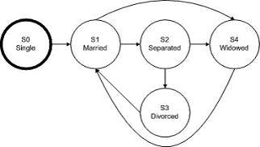
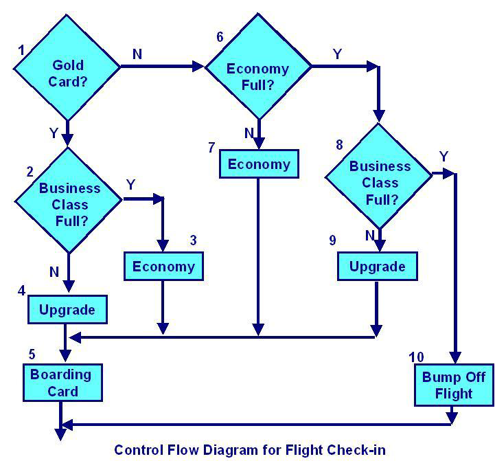

# Exam Questions : Chapter 04 (Part 2)

1. White Box Testing
    1. Same as glass box testing 
    2. Same as clear box testing 
    3. Both A. and B. 
    4. None of the above.

2. Equivalence partitioning consists of various activities: 
    1. Ensure that test cases test each input and output equivalence class at least once 
    2. Identify all inputs and all outputs 
    3. Identify equivalence classes for each input 
    4. All of the above

3. Structural Testing
    1. Same as black box testing 
    2. Same as white box testing 
    3. Same as functional testing 
    4. None of the above.

3. Path coverage includes
    1. Statement coverage 
    2. Condition coverage 
    3. Decision coverage 
    4. None of these

4. Which testing technique do you prefer for the following situations?
    - A. Severe time pressure 
    - B. Inadequate specification

    1. Decision testing 
    2. Error guessing 
    3. Statement testing 
    4. Exploratory testing

5. Recovery testing is a system test that forces the software to fail and verifies that data recovery is properly performed. The following should be checked for correctness
    - 1. Re-initialization 
    - 2. Restart
    - 3. Data Recovery 
    - 4. Check Point Mechanism

    1. 1 and 2 
    2. 1, 2 and 3 
    3. 1, 2, 3 and 4 
    4. 2 and 4

6. Data flow analysis studies:
    1. Possible communications bottlenecks in a program. 
    2. The rate of change of data values as a program executes. 
    3. The use of data on paths through the code. 
    4. The intrinsic complexity of the code.

7. Which of the following is NOT a white box technique?
    1. Statement testing 
    2. Path testing 
    3. Data flow testing 
    4. State transition testi

8. Which of the following statements is NOT correct?
    1. A minimal test set that achieves 100% LCSAJ coverage will also achieve 100% branch coverage.
    2. A minimal test set that achieves 100% path coverage will also achieve 100% statement coverage.
    3. A minimal test set that achieves 100% path coverage will generally detect more faults than one that achieves 100% statement coverage. 
    4. A minimal test set that achieves 100% statement coverage will generally detect more faults than one that achieves 100% branch coverage.

9. Error guessing: 
    1. Supplements formal test design techniques. 
    2. Can only be used in component, integration and system testing. 
    3. Is only performed in user acceptance testing. 
    4. Is not repeatable and should not be used.

10. In a system designed to work out the tax to be paid:
    ```
    An employee has £4000 of salary tax free. The next £1500 is taxed at 10% The next £28000 is taxed at 22%
    Any further amount is taxed at 40% Which of these groups of numbers would fall into the same equivalence class?
    ```

    1. £4800; £14000; £28000 
    2. £5200; £5500; £28000 
    3. £28001; £32000; £35000 
    4. £5800; £28000; £32000

11. In a system designed to work out the tax to be paid:
    ```
    An employee has £4000 of salary tax free. The next £1500 is taxed at 10% The next £28000 is taxed at 22%
    Any further amount is taxed at 40%
    ```

    To the nearest whole pound, which of these is a valid Boundary Value Analysis test case?

    1. £1500 
    2. £32001 
    3. £33501 
    4. £28000

12. Which of the following is NOT true of test coverage criteria?
    1. Test coverage criteria can be measured in terms of items exercised by a test suite. 
    2. A measure of test coverage criteria is the percentage of user requirements covered. 
    3. A measure of test coverage criteria is the percentage of faults found. 
    4. Test coverage criteria are often used when specifying test completion criteria.

13. Analyze the following highly simplified procedure:
    ```
    1. Ask: "What type of ticket do you require, single or return?" 
    2. IF the customer wants ‘return’ 
    3. Ask: "What rate, Standard or Cheap-day?" 
    4. IF the customer replies ‘Cheap-day’ 
    5. Say: "That will be £11:20" 
    6. ELSE 
    7. Say: "That will be £19:50" 
    8. ENDIF 
    9. ELSE 
    10. Say: "That will be £9:75" 
    11. ENDIF
    ```

    Now decide the minimum number of tests that are needed to ensure that all the questions have been asked, all combinations have occurred and all replies given.

    1. 3 
    2. 4 
    3. 5 
    4. 6

14. Given the following specification, which of the following values for age are in the SAME equivalence partition?

    ```
    If you are less than 18, you are too young to be insured. Between 18 and 30 inclusive, you will receive a 20% discount. Anyone over 30 is not eligible for a discount.
    ```

    1. 17, 18, 19. 
    2. 29, 30, 31. 
    3. 18, 29, 30. 
    4. 17, 29, 31.

15. Consider the following statements:
    - i.100% statement coverage guarantees 100% branch coverage. 
    - ii.100% branch coverage guarantees 100% statement coverage. 
    - iii.100% branch coverage guarantees 100% decision coverage. 
    - iv.100% decision coverage guarantees 100% branch coverage. 
    - v.100% statement coverage guarantees 100% decision coverage.

    1. ii is True; i, iii, iv & v are False 
    2. i & v are True; ii, iii & iv are False 
    3. ii & iii are True; i, iv & v are False 
    4. ii, iii & iv are True; i & v are False

16. In a system designed to work out the tax to be paid:
    ```
    An employee has £4000 of salary tax free. The next £1500 is taxed at 10%. The next £28000 after that is taxed at 22%. Any further amount is taxed at 40%.
    ```

    To the nearest whole pound, which of these is a valid Boundary Value Analysis test case?

    1. £28000. 
    2. £33501. 
    3. £32001. 
    4. £1500.

17. Considering the following pseudo-code, calculate the MINIMUM number of test cases for statement coverage, and the MINIMUM number of test cases for decision coverage respectively.
    ```
    READ A 
    READ B 
    READ C 
    IF C>A THEN 
    IF C>B THEN 
    PRINT "C must be smaller than at least one number" 
    ELSE 
    PRINT "Proceed to next stage" 
    ENDIF 
    ELSE 
    PRINT "B can be smaller than C" 
    ENDIF
    ```

    1. 3, 3. 
    2. 2, 3. 
    3. 2, 4. 
    4. 3, 2.

18. The following statements are used to describe the basis for creating test cases using either black or white box techniques:
    - i. Information about how the software is constructed. 
    - ii. Models of the system, software or components. 
    - iii. Analysis of the test basis documentation. 
    - iv. Analysis of the internal structure of the components.

    Which combination of the statements describes the basis for black box techniques? 

    1. ii and iii. 
    2. ii and iv. 
    3. i and iv. 
    4. i and iii.

19. Consider the following techniques. Which are static and which are dynamic techniques?
    - i. Equivalence Partitioning. 
    - ii. Use Case Testing. 
    - iii.Data Flow Analysis. 
    - iv.Exploratory Testing. 
    - v. Decision Testing. 
    - vi Inspections.

    1. i-iv are static, v-vi are dynamic. 
    2. iii and vi are static, i, ii, iv and v are dynamic. 
    3. ii, iii and vi are static, i, iv and v are dynamic. 
    4. vi is static, i-v are dynamic.

20. the following code, which statement is true about the minimum number of test cases required for full statement and branch coverage?
    ```
    Read p 
    Read q 
    IF p+q > 100 THEN 
    Print "Large" 
    ENDIF 
    IF p > 50 THEN 
    Print "p Large" 
    ENDIF
    ```

    1. 1 test for statement coverage, 3 for branch coverage 
    2. 1 test for statement coverage, 2 for branch coverage 
    3. 1 test for statement coverage, 1 for branch coverage 
    4. 2 tests for statement coverage, 2 for branch coverage

21. In a system designed to work out the tax to be paid:
    ```
    An employee has £4000 of salary tax free. 
    The next £1500 is taxed at 10%. 
    The next £28000 after that is taxed at 22%. 
    Any further amount is taxed at 40%.
    ```

    To the nearest whole pound, which of these groups of numbers fall into three DIFFERENT equivalence classes?

    1. £4000; £5000; £5500. 
    2. £32001; £34000; £36500. 
    3. £28000; £28001; £32001. 
    4. £4000; £4200; £5600

22. Which of the following statements about component testing is FALSE? 
    1. Black box test design techniques all have an associated test measurement technique 
    2. White box test design techniques all have an associated test measurement technique 
    3. Cyclomatic complexity is not a test measurement technique 
    4. Black box test measurement techniques all have an associated test design technique

23. When testing a grade calculation system, a tester determines that all scores from 90 to 100 will yield a grade of A, but scores below 90 will not. This analysis is known as: 
    1. Equivalence partitioning 
    2. Boundary value analysis 
    3. Decision table 
    4. Hybrid analysis

24. Which technique can be used to achieve input and output coverage? It can be applied to human input, input via interfaces to a system, or interface parameters in integration testing.
    1. Error Guessing 
    2. Boundary Value Analysis 
    3. Decision Table testing 
    4. Equivalence partitioning

25. Which of the following statements is true about white-box testing?
    1. It includes functional testing 
    2. It includes loop testing 
    3. It is usually done after black-box testing 
    4. It is usually done during the integration testing phase

26. Which test suite will check for an invalid transition using the diagram below?

    

    1. S0-S1-S2-S3-S1-S4 
    2. S0-S1-S4-S1-S2-S3 
    3. S0-S1-S3-S1-S2-S1 
    4. S0-S1-S2-S3-S1-S2

27. In an Examination a candidate has to score minimum of 24 marks in order to clear the exam. The maximum that he can score is 40 marks. Identify the Valid Equivalence values if the student clears the exam.
    1. 22,23,26 
    2. 21,39,40 
    3. 29,30,31 
    4. 0,15,22

28. What is the expected result for each of the following test cases?
   
    | | Rule 1 | Rule 2 | Rule 3 | Rule 4 |
    | -- | -- | -- | -- | -- |
    | **Conditions** | | | | | 
    | Indian Resident? | False | True | True | True |
    | Age between 18-55 | Don’t Care | False | True | True |
    | Married | Don’t Care | Don’t Care | False | True |
    | **Actions** | | | | |
    | Issue Membership? | False | False | True | True |
    | Offer 10% discount? | False | False | True | False |

    - A.TC1: Anand is a 32 year old married, residing in Kolkatta. 
    - B.TC3: Attapattu is a 65 year old married person, residing in Colombo. 
  
    1. A – Issue membership, 10% discount, B–Issue membership, offer no discount. 
    2. A – Don’t Issue membership, B – Don’t offer discount. 
    3. A – Issue membership, no discount, B – Don’t Issue membership. 
    4. A – Issue membership, no discount, B- Issue membership with 10% discount.

> Evaluation of different options:

| | Rule 1 | Rule 2 | Rule 3 | Rule 4 |
| -- | -- | -- | -- | -- |
| **Conditions** | | | | | 
| Indian Resident? | <span style="color:blue">**False**</span> | <span style="color:green">**True**</span> | <span style="color:green">**True**</span> | <span style="color:green">**True**</span> |
| Age between 18-55 | <span style="color:blue">**Don’t Care**</span> | False | <span style="color:green">**True**</span> | <span style="color:green">**True**</span> |
| Married | <span style="color:blue">**Don’t Care**</span> | *Don’t Care* | False | <span style="color:green">**True**</span> |
| **Actions** | | | | |
| Issue Membership? | False | False | True | <span style="color:green">**True**</span> |
| Offer 10% discount? | False | False | True | <span style="color:green">**True**</span> |

Explanation: 

**For TC1: follow the path in <span style="color:green">green</span> color**
(The person is Indian resident, so select only ‘True’ options. The person is aged between 18-55, so select only ‘True’ The person is a married, so again select only ‘True’ For this person, the actions under ‘Rule 4′ will be applied. That is, issue membership and no discount)

**For TC3: follow the path in <span style="color:blue">blue</span> color** 
(The person is not Indian resident, so select only ‘False’ (under Rule 1) The person is not aged between 18-55. No need to select any path, as it is written “Don’t care”. The person is married. No need to select any path, as it is written “Don’t care”. For this person, the actions under ‘Rule1′ will be applied, That is, Don’t issue membership and no discount.)

29. Which of the following statements about decision tables are TRUE?
    - I. Decision tables are useful when dealing with multiple inputs that do not interact.
    - II. The strength of a decision table is that it creates combinations of inputs that might not otherwise been evaluated.
    - III. Decision tables are useful when trying to capture system requirements that contain logical conditions.
    - IV. Each column of a decision table corresponds to a business rule that defines a unique combination of conditions.

    1. II, III and IV
    2. I and IV
    3. I, II and III
    4. I and III

30. Which of the following statements is true about white-box testing?
    1. It includes functional testing. 
    2. It includes loop testing.
    3. It is usually done after black-box testing. 
    4. It is usually done during the integration testing phase.

31. Which of the following are Black Box test design techniques?
    - I. Boundary value analysis
    - II. Branch condition testing
    - III. Equivalence partitioning
    - IV. State transition testing.

    1. I, II, III and IV
    2. I and III
    3. III and IV 
    4. I, III and IV

32. Which of the following statements are true for the equivalence partitioning test technique?
    - I. Divides possible inputs into classes that have the same behavior 
    - II. Can be used to create both positive and negative test cases 
    - III. Makes use of only positive test cases for the equivalence partitions 
    - IV. Must always include at least two values from every equivalence partition 
    - V. Can be used only for input testing
  
    1. I and II 
    2. I, II and V 
    3. I, III and IV 
    4. I and V

1.  The following code segment contains a potential "divide by 0" error.
    ```
    J=50 
    K=1 
    while (N>=10) and (N<=10) loop 
    M [K] = J/N 
    K = K + 1 
    N = N - 1 
    end loop 
    ```

    Which of the following is the most effective way of detecting this error?

    1. Boundary testing 
    2. Condition testing 
    3. Compilation of the source code 
    4. Source code inspection

34. Which of the following statements about the benefits of deriving test cases from use cases are true?
    - I. Deriving test cases from use cases is helpful for system and acceptance testing.
    - II. Deriving test cases from use cases is helpful only for automated testing
    - III. Deriving test cases from use cases is helpful for unit testing.
    - IV. Deriving test cases from use cases is helpful for testing the interaction and interference between different components.
  
    1. I
    2. I and II.
    3. III 
    4. I and IV

35.  For the following piece of code, how many test cases are needed to get 100% statement coverage? 
    ```
    Procedure X 
    Read (Color) // Input color from user 
    IF (Color == “Red”) THEN 
    Call Roses(Color) 
    ELSEIF (Color == “Blue”) THEN 
    Call Violets(Color) 
    ELSE 
    PRINT “User is no Shakespeare” 
    SaveToDatabase(Color) 
    End Procedure X
    ```

    1. 5 
    2. 3 
    3. 1 
    4. 2

36. Why are both specification-based and structure-based testing techniques useful? 
    1. They find different types of defect. 
    2. Using more techniques is always better. 
    3. Both find the same types of defect. 
    4. Because specifications tend to be unstructured.

37. What is a key characteristic of structure-based testing techniques?
    1. They are mainly used to assess the structure of a specification. 
    2. They are used both to measure coverage and to design tests to increase coverage. 
    3. They are based on the skills and experience of the tester. 
    4. They use a formal or informal model of the software or component.

38. Which of the following would be an example of decision-table testing for a financial application applied at the system-test level?
    1. A table containing rules for combinations of inputs to two fields on a screen. 
    2. A table containing rules for interfaces between components. 
    3. A table containing rules for mortgage applications. 
    4. A table containing rules for chess.

39. Which of the following could be a coverage measure for state transition testing?
    - V. All states have been reached. 
    - W. The response time for each transaction is adequate. 
    - X. Every transition has been exercised. 
    - Y. All boundaries have been exercised. 
    - Z. Specific sequences of transitions have been exercised.

    1. X, Y and Z 
    2. V, X, Y and Z 
    3. W,X and Y 
    4. V, X and Z

40. Postal rates for 'light letters' are 25p up to 10g, 35p up to 50g plus an extra 10p for each additional 25g up to 100g. Which test inputs (in grams) would be selected using equivalence partitioning?
    1. 8, 42, 82, 102 
    2. 4, 15, 65, 92, 159 
    3. 10, 50, 75, 100 
    4. 5, 20, 40, 60, 80

41. Which of the following could be used to assess the coverage achieved for specification based (black-box) test techniques?
    - V. Decision outcomes exercised 
    - W. Partitions exercised 
    - X. Boundaries exercised 
    - Y. State transitions exercised 
    - Z. Statements exercised

    1. Y, W, Y, or Z 
    2. W, X or Y 
    3. V, X or Z 
    4. W, X, Y or Z

42. Which of the following would structure-based test design techniques be most likely to be applied to?
    1. Boundaries between mortgage interest rate bands. 
    2. An invalid transition between two different arrears statuses. 
    3. The business process flow for mortgage approval. 
    4. Control flow of the program to calculate repayments.

    1. 2, 3 and 4 
    2. 2 and 4 
    3. 3 and 4 
    4. 1, 2 and 3

43. Use case testing is useful for which of the following?
    P. Designing acceptance tests with users or customers. 
    Q. Making sure that the mainstream business processes are tested. 
    R. Finding defects in the interaction between components. 
    S. Identifying the maximum and minimum values for every input field. 
    T. Identifying the percentage of statements exercised by a sets of tests. 

    1. P, Q and R 
    2. Q, S and T 
    3. P, Q and S 
    4. R, S and T

44. Which of the following statements about the relationship between statement coverage and decision coverage is correct?
    1. 100% decision coverage is achieved if statement coverage is greater than 90%. 
    2. 100% statement coverage is achieved if decision coverage is greater than 90%. 
    3. 100% decision coverage always means 100% statement coverage. 
    4. 100% statement coverage always means 100% decision coverage.

45. If you are flying with an economy ticket, there is a possibility that you may get upgraded to business class, especially if you hold a gold card in the airline's frequent flier program. If you don't hold a gold card, there is a possibility that you will get 'bumped' off the flight if it is full and you check in late? This is shown in following Figure. Note that each box (i.e. statement) has been numbered.

    

    Three tests have been run:

    - Test 1: Gold card holder who gets upgraded to business class 
    - Test 2: Non-gold card holder who stays in economy 
    - Test 3: A person who is bumped from the flight

    What is the statement coverage of these three tests?

    1. 60% 
    2. 70% 
    3. 80% 
    4. 90%


## Answers

| Question | Correct Answer |
| ---- | --- |
| 1 |  |
| 2 |  |
| 3 |  |
| 4 |  |
| 5 |  |
| 6 |  |
| 7 |  |
| 8 |  |
| 9 |  |
| 10 |  |
| 11 |  |
| 12 |  |
| 13 |  |
| 14 |  |
| 15 |  |
| 16 |  |
| 17 |  |
| 18 |  |
| 19 |  |
| 20 |  |
| 21 |  |
| 22 |  |
| 23 |  |
| 24 |  |
| 25 |  |
| 26 |  |
| 27 |  |
| 28 |  |
| 29 |  |
| 30 |  |
| 31 |  |
| 32 |  |
| 33 |  |
| 34 |  |
| 35 |  |
| 36 |  |
| 37 |  |
| 38 |  |
| 39 |  |
| 40 |  |
| 41 |  |
| 42 |  |
| 43 |  |
| 44 |  |
| 45 |  |
| 46 |  |
| 47 |  |
| 48 |  |
| 49 |  |
| 50 |  |
| 51 |  |
| 52 |  |
| 53 |  |
| 54 |  |
| 55 |  |
| 56 |  |
| 57 |  |